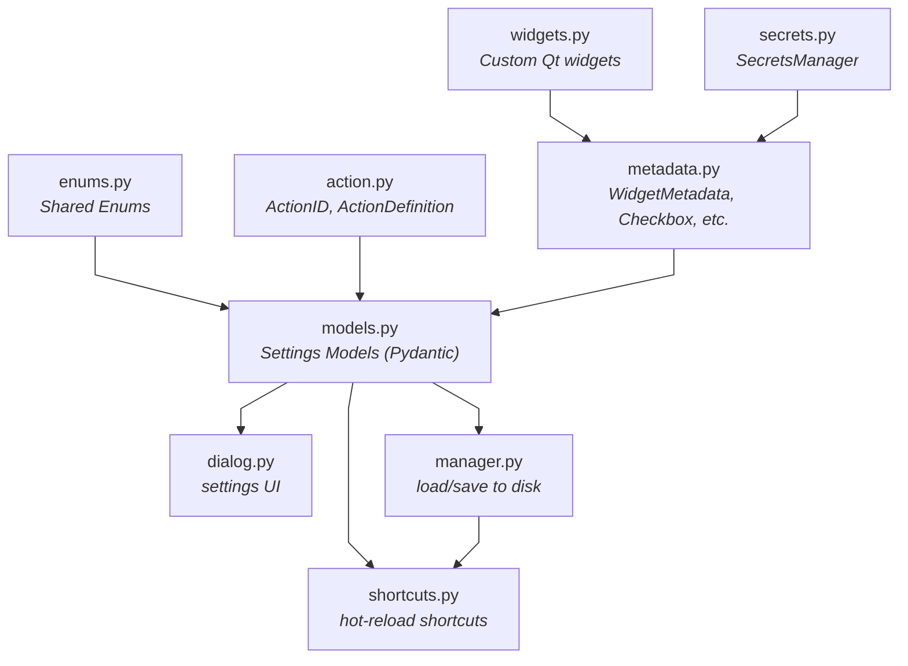

# Settings Module

- **Actions & Shortcuts**: Defined in `action.py` and managed by `ShortcutManager` in `shortcuts.py`.
- **Metadata**: UI metadata for settings (widgets, labels, transforms) is defined in `metadata.py`.
- **Models**: Pydantic models for settings storage are in `models.py`.
- **GUI**: The settings dialog is in `dialog.py`, while custom widgets are in `widgets.py`.

## Adding a Shortcut

### 1. Add ActionID (`action.py`)

```python
class ActionID(StrEnum):
    MY_ACTION = "scope.my_action", "My Action Label", "Ctrl+M"
    #             ↑ action_id        ↑ label            ↑ default key
```

### 2. Register for hot-reload

```python
from .settings import ActionID, ShortcutManager

# For QAction (e.g., menu items):
ShortcutManager.register_action(ActionID.MY_ACTION, my_action)

# For standalone shortcuts (global to a widget):
ShortcutManager.register_shortcut(ActionID.MY_ACTION, callback, parent_widget)
```

---

## Adding a Setting

Define a field with annotation and default value in a `BaseModel` in `models.py`.

```python
from .metadata import Checkbox

class GlobalSettings(BaseModel):
    __section__ = "General"

    my_feature: Annotated[bool, Checkbox(label="My Feature", text="Enable")] = False
```

---

## Widget Types

Defined in `metadata.py`:

| Type             | Annotation Example                                                           |
| ---------------- | ---------------------------------------------------------------------------- |
| `Checkbox`       | `Annotated[bool, Checkbox(label="Enabled", text="Check me")]`                |
| `Dropdown`       | `Annotated[str, Dropdown(label="Mode", items=[("A", "a")])]`                 |
| `Spin`           | `Annotated[int, Spin(label="Size", min=0, max=100, suffix="px")]`            |
| `DoubleSpin`     | `Annotated[float, DoubleSpin(label="Val", min=0, max=1)]`                    |
| `PlainTextEdit`  | `Annotated[list[float], PlainTextEdit(label="List", value_type=float)]`      |
| `WidgetTimeEdit` | `Annotated[QTime, WidgetTimeEdit(label="Interval", display_format="mm:ss")]` |
| `ColorPicker`    | `Annotated[str, ColorPicker(label="Color")]`                                 |
| `Login`          | `Annotated[str, Login(label="API Key", namespace="...", context="...")]`     |

### Value Transforms (for unit conversion)

```python
drag_timeout: Annotated[
    float,
    Spin(
        label="Timeout",
        suffix=" ms",
        to_ui=lambda v: int(v * 1000),   # seconds -> ms (display)
        from_ui=lambda v: v / 1000.0,    # ms -> seconds (storage)
)] = 0.04  # Default in seconds
```

---

## Architecture

### Module Dependencies



### File Responsibilities

| File           | Purpose                                                                                          |
| -------------- | ------------------------------------------------------------------------------------------------ |
| `widgets.py`   | Specialized Qt widgets used within the settings dialog.                                          |
| `secrets.py`   | `SecretsManager` - Secure storage for sensitive data via OS keyring.                             |
| `enums.py`     | Shared enumerations used across the settings system.                                             |
| `action.py`    | Defines `ActionID` enum and `ActionDefinition` for shortcuts.                                    |
| `metadata.py`  | UI metadata classes (`WidgetMetadata`, `Checkbox`, etc.) that link models to widgets.            |
| `models.py`    | Pydantic settings models for the application and plugins.                                        |
| `dialog.py`    | `SettingsDialog` - Builds the UI dynamically by introspecting models.                            |
| `manager.py`   | `SettingsManager` singleton - Handles persistent JSON storage (Global and Local).                |
| `shortcuts.py` | `ShortcutManager` singleton - Manages shortcut lifecycle, hot-reloading, and conflict detection. |
